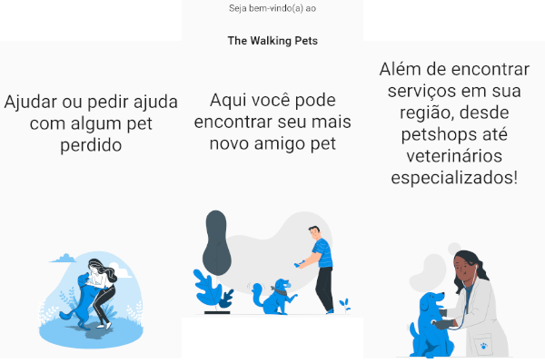

<h1 align="center">The Walking Pets</h1>

Find Your Newest Pet Friend!

 

## About The Project
A project whose premise is to facilitate the adoption of domestic animals, which have been registered through donors such as NGOs or individuals who wish to donate their pets. In addition, the project's secondary objective is to help pet tutors find their lost animals, through an advertisement made by him or by third parties who have found him a homeless animal.

---

### Back-end
[Click here](https://github.com/luanvsfeo/backend-the-walking-pets) to view our back-end repo built with Spring Boot!

---

### Built With

* [Flutter](http://flutter.dev/)
* [Rive](https://rive.app/)
* [Spring Boot](https://spring.io/)
* [Hasura](https://hasura.io/) (During development)
* [Firebase Cloud Storage](https://firebase.google.com/docs/storage)
* [Flutter Icons](fluttericon.com)

---

## Acknowledgements
* Adote Taboão da Serra - [Facebook](https://www.facebook.com/adotetaboaodaserra/) / [Instagram](https://www.instagram.com/adotetaboaodaserra)
* [Storyset](https://storyset.com/)
* [Figma](https://www.figma.com/)
* [Adobe Colors](https://color.adobe.com/)