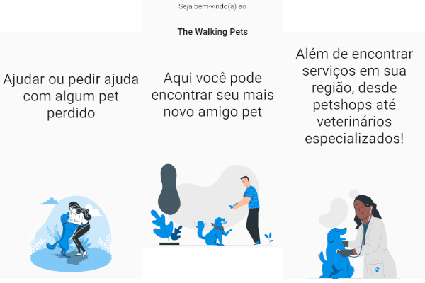

<h1 align="center">The Walking Pets</h1>

Encontre seu mais novo amigo Pet!

## Sobre o projeto

Um projeto que tem como premissa, facilitar a adoção de animais domésticos, nos quais foram cadastrados através de doadores como ONGs ou pessoas físicas que desejam doar seus pets. Além disso, o projeto tem como objetivo secundário, auxiliar tutores de pets a encontrarem seus animais perdidos, através de anúncio feito por ele ou por terceiros que o tenham encontrado algum animal em situação de rua

### Back-end
[Clique aqui](https://github.com/luanvsfeo/backend-the-walking-pets) para conferir o nosso repositório do back-end feito em Spring Boot!

### Feito com
* [Flutter](http://flutter.dev/)
* [Rive](https://rive.app/)
* [Spring Boot](https://spring.io/)
## Agradecimentos
* Adote Taboão da Serra - [Facebook](https://www.facebook.com/adotetaboaodaserra/) / [Instagram](https://www.instagram.com/adotetaboaodaserra)
* [Storyset](https://storyset.com/)
* [Figma](https://www.figma.com/)
* [Adobe Colors](https://color.adobe.com/)

